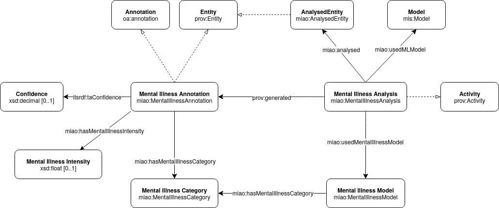

# MIAO: Mental Illness Analysis Ontology

## Introduction

**MIAO (Mental Illness Analysis Ontology)** is an ontology designed to represent and model the process of analyzing and detecting mental health conditions from various data sources. It provides a structured vocabulary for describing entities, activities, annotations, and models involved in mental illness analysis, particularly in computational settings.

The ontology is built upon well-established vocabularies such as PROV-O for provenance, the Web Annotation Ontology (OA) for annotations, and the Machine Learning Schema (MLS) for ML models, ensuring interoperability and extensibility.

**Namespace URI:** `http://www.gsi.upm.es/ontologies/miao/ns#`  
**Preferred Prefix:** `miao`

---

## Ontology Overview

MIAO revolves around a few core concepts that model the entire analysis pipeline, from the source data to the final, categorized annotation.



### Core Classes

*   `miao:AnalysedEntity`: Represents any entity serving as the source for mental illness analysis. This can be textual data (e.g., clinical notes, social media posts) or agents (e.g., patients, questionnaire respondents).
*   `miao:MentalIllnessAnalysis`: An activity that represents the process of analyzing a resource to detect, annotate, or infer mental illnesses or related characteristics. It is a subclass of `prov:Activity`.
*   `miao:MentalIllnessAnnotation`: Represents an annotation indicating the presence, symptoms, or characteristics of a mental illness. It is a subclass of `oa:Annotation`.
*   `miao:MentalIllnessModel`*: Represents a conceptual or computational model used to categorize, structure, or assess mental illnesses and related phenomena. This includes clinical classification systems (e.g., DSM-5, ICD-11), computational models for symptom grouping or severity grading, or custom frameworks defining both typologies and levels of mental health conditions.
*`miao:MentalIllnessCategory`*: Represents a category related to mental illnesses, which may refer either to (a) the type or class of mental illness (e.g., anxiety disorder, depressive disorder) as defined by a particular model or classification system, or (b) the severity or level of a specific condition (e.g., mild, moderate, severe), according to the criteria of the applied model.

### Core Properties

*   `miao:analysed`: Links an analysis activity (`miao:MentalIllnessAnalysis`) to the entity being analysed (`miao:AnalysedEntity`).
*   `miao:usedMentalIllnessModel`: Specifies the `miao:MentalIllnessModel` used in a particular analysis activity.
*   `miao:hasMentalIllnessCategory`: Links a `miao:MentalIllnessAnnotation` or a `miao:MentalIllnessModel` to a specific `miao:MentalIllnessCategory`.
*   `miao:hasMentalIllnessIntensity`: A datatype property that quantifies the intensity or severity of a detected mental illness or symptom, associated with a `miao:MentalIllnessAnnotation`.
*   `miao:usedMLModel`: Links an analysis activity to a machine learning model (`mls:Model`) used to perform it.


---

## Example of Use


## Use Cases

This section illustrates practical scenarios and example data patterns for using the MIAO ontology in mental illness analysis. The examples demonstrate how to define classification models and categories, integrate with external mental health ontologies, and annotate resources with either disorder typologies or severity levels.

---

### Example 1: Defining Models and Categories

```

@prefix mhc: [http://example.org/mentalhealth/classification\#](http://example.org/mentalhealth/classification#) .
@prefix miao: [http://www.gsi.upm.es/ontologies/miao/ns\#](http://www.gsi.upm.es/ontologies/miao/ns#) .
@prefix rdfs: [http://www.w3.org/2000/01/rdf-schema\#](http://www.w3.org/2000/01/rdf-schema#) .

# Typology model 

mhc:ICD11 a miao:MentalIllnessModel ;
    rdfs:label "ICD-11 Typology" ;
    miao:hasMentalIllnessCategory mhc:DepressiveDisorder, mhc:AnxietyDisorder .

mhc:DepressiveDisorder a miao:MentalIllnessCategory ;
    rdfs:label "Depressive Disorder" .

mhc:AnxietyDisorder a miao:MentalIllnessCategory ;
    rdfs:label "Anxiety Disorder" .

# Severity model

mhc:ICD11Severity a miao:MentalIllnessModel ;
    rdfs:label "ICD-11 Severity Levels" ;
    miao:hasMentalIllnessCategory mhc:Mild, mhc:Severe .

mhc:Mild a miao:MentalIllnessCategory ;
    rdfs:label "Mild" .

mhc:Severe a miao:MentalIllnessCategory ;
    rdfs:label "Severe" .

```

**Description:**  
Models for disorder typologies and severity levels are defined as separate `MentalIllnessModel` instances, each with their respective categories.

---

### Example 2: Manual Annotation of a Clinical Note (Typology)

```

@prefix : [http://www.gsi.upm.es/ontologies/miao/examples\#](http://www.gsi.upm.es/ontologies/miao/examples#) .
@prefix miao: [http://www.gsi.upm.es/ontologies/miao/ns\#](http://www.gsi.upm.es/ontologies/miao/ns#) .
@prefix oa: [http://www.w3.org/ns/oa\#](http://www.w3.org/ns/oa#) .
@prefix prov: [http://www.w3.org/ns/prov\#](http://www.w3.org/ns/prov#) .
@prefix itsrdf: [http://www.w3.org/2005/11/its/rdf\#](http://www.w3.org/2005/11/its/rdf#) .
@prefix mhc: [http://example.org/mentalhealth/classification\#](http://example.org/mentalhealth/classification#) .
@prefix xsd: [http://www.w3.org/2001/XMLSchema\#](http://www.w3.org/2001/XMLSchema#) .

:note1 a miao:AnalysedEntity, schema:MedicalRecord ;
    schema:articleBody "Patient reports persistent sadness and loss of interest in daily activities." ;
    schema:dateCreated "2025-06-10"^^xsd:date .

:annotator1 a prov:Person ;
    rdfs:label "Dr. Jane Smith" .

:analysis1 a miao:MentalIllnessAnalysis ;
    prov:wasAssociatedWith :annotator1 ;
    miao:analysed :note1 ;
    miao:usedMentalIllnessModel mhc:ICD11 ;
    prov:generated :annotation1 .

:annotation1 a miao:MentalIllnessAnnotation ;
    miao:hasMentalIllnessCategory mhc:DepressiveDisorder ;
    miao:hasMentalIllnessIntensity "0.85"^^xsd:float ;
    itsrdf:taConfidence "0.95"^^xsd:decimal ;
    oa:hasTarget :note1 .

```

**Description:**  
A clinician manually annotates a clinical note, assigning a disorder typology from the ICD-11 model.

---

### Example 3: Manual Annotation of a Clinical Note (Severity Level)

```

@prefix : [http://www.gsi.upm.es/ontologies/miao/examples\#](http://www.gsi.upm.es/ontologies/miao/examples#) .
@prefix miao: [http://www.gsi.upm.es/ontologies/miao/ns\#](http://www.gsi.upm.es/ontologies/miao/ns#) .
@prefix oa: [http://www.w3.org/ns/oa\#](http://www.w3.org/ns/oa#) .
@prefix prov: [http://www.w3.org/ns/prov\#](http://www.w3.org/ns/prov#) .
@prefix itsrdf: [http://www.w3.org/2005/11/its/rdf\#](http://www.w3.org/2005/11/its/rdf#) .
@prefix mhc: [http://example.org/mentalhealth/classification\#](http://example.org/mentalhealth/classification#) .
@prefix xsd: [http://www.w3.org/2001/XMLSchema\#](http://www.w3.org/2001/XMLSchema#) .

:analysis2 a miao:MentalIllnessAnalysis ;
    prov:wasAssociatedWith :annotator1 ;
    miao:analysed :note1 ;
    miao:usedMentalIllnessModel mhc:ICD11Severity ;
    prov:generated :annotation2 .

:annotation2 a miao:MentalIllnessAnnotation ;
    miao:hasMentalIllnessCategory mhc:Severe ;
    miao:hasMentalIllnessIntensity "0.85"^^xsd:float ;
    itsrdf:taConfidence "0.95"^^xsd:decimal ;
    oa:hasTarget :note1 .

```

**Description:**  
A separate annotation records the severity level ("Severe") using a category from the severity model (`ICD11Severity`). 

---


### Example 4: Automated Analysis Using a Machine Learning Model

```

@prefix : [http://www.gsi.upm.es/ontologies/miao/examples\#](http://www.gsi.upm.es/ontologies/miao/examples#) .
@prefix miao: [http://www.gsi.upm.es/ontologies/miao/ns\#](http://www.gsi.upm.es/ontologies/miao/ns#) .
@prefix oa: [http://www.w3.org/ns/oa\#](http://www.w3.org/ns/oa#) .
@prefix prov: [http://www.w3.org/ns/prov\#](http://www.w3.org/ns/prov#) .
@prefix mls: [http://www.w3.org/ns/mls\#](http://www.w3.org/ns/mls#) .
@prefix itsrdf: [http://www.w3.org/2005/11/its/rdf\#](http://www.w3.org/2005/11/its/rdf#) .
@prefix mhc: [http://example.org/mentalhealth/classification\#](http://example.org/mentalhealth/classification#) .
@prefix xsd: [http://www.w3.org/2001/XMLSchema\#](http://www.w3.org/2001/XMLSchema#) .

:tweet1 a miao:AnalysedEntity, schema:SocialMediaPosting ;
    schema:text "I can't sleep and feel anxious all the time." ;
    schema:dateCreated "2025-07-01"^^xsd:date .

:ml_model1 a mls:Model ;
    rdfs:label "Anxiety Detector BERT v2.1" .

:analysis2 a miao:MentalIllnessAnalysis ;
    prov:wasAssociatedWith :ml_agent1 ;
    miao:analysed :tweet1 ;
    miao:usedMentalIllnessModel mhc:ICD11 ;
    miao:usedMLModel :ml_model1 ;
    prov:generated :annotation3 .

:annotation3 a miao:MentalIllnessAnnotation ;
    miao:hasMentalIllnessCategory mhc:AnxietyDisorder ;
    miao:hasMentalIllnessIntensity "0.67"^^xsd:float ;
    itsrdf:taConfidence "0.81"^^xsd:decimal ;
    oa:hasTarget :tweet1 .

```

**Description:**  
A machine learning agent analyzes a social media post and assigns a disorder typology.

---

### Example 5: Multi-Source Analysis

```

:patient1 a prov:Person ;
    schema:identifier "P12345" .

:questionnaire1 a miao:AnalysedEntity, schema:Questionnaire ;
    schema:about :patient1 ;
    schema:dateCreated "2025-07-05"^^xsd:date .

:note2 a miao:AnalysedEntity, schema:MedicalRecord ;
    schema:about :patient1 ;
    schema:dateCreated "2025-07-06"^^xsd:date .

:analysis3 a miao:MentalIllnessAnalysis ;
    prov:wasAssociatedWith :ml_agent2 ;
    miao:analysed :questionnaire1, :note2 ;
    miao:usedMentalIllnessModel mhc:ICD11 ;
    miao:usedMLModel :ml_model2 ;
    prov:generated :annotation4 .

:annotation4 a miao:MentalIllnessAnnotation ;
    miao:hasMentalIllnessCategory mhc:DepressiveDisorder ;
    miao:hasMentalIllnessIntensity "0.55"^^xsd:float ;
    itsrdf:taConfidence "0.88"^^xsd:decimal ;
    oa:hasTarget :questionnaire1, :note2 .

```

**Description:**  
An analysis aggregates information from multiple sources (questionnaire and clinical note) for a single patient, producing a unified annotation with a disorder typology. Severity, if needed, would be annotated separately or as an intensity value.

---

These use cases demonstrate MIAO's flexibility for representing both manual and automated mental illness annotation and supporting multi-source integration.